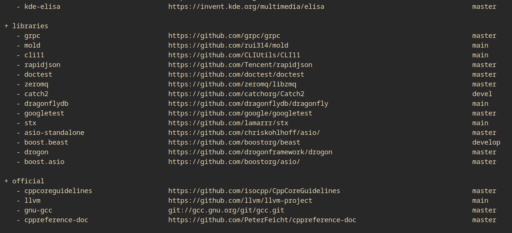

<!--
Onur is free software: you can redistribute it and/or modify
it under the terms of the GNU General Public License as published by
the Free Software Foundation, either version 3 of the License, or
(at your option) any later version.

Onur is distributed in the hope that it will be useful,
but WITHOUT ANY WARRANTY; without even the implied warranty of
MERCHANTABILITY or FITNESS FOR A PARTICULAR PURPOSE.  See the
GNU General Public License for more details.

You should have received a copy of the GNU General Public License
along with Onur. If not, see <https://www.gnu.org/licenses/>.
-->

# Onur | Rust

Easily manage multiple FLOSS repositories.

[cpp](https://gitlab.com/easbarba/onur-cpp) | [c](https://gitlab.com/easbarba/onur) | [dotnet](https://gitlab.com/easbarba/onur-dotnet) | [go](https://gitlab.com/easbarba/onur-go) | [php](https://gitlab.com/easbarba/onur-php) | [java](https://gitlab.com/easbarba/onur-java) 
| [ruby](https://gitlab.com/easbarba/onur-ruby)

## Usage

```shell
# grab all projects
onur grab 

# grab only the c projects
onur grab c 

# list the cpp configuration file
onur config cpp 

# list topics of haskell
onur config haskell.

# list only the projects on misc topic of lisp
onur config lisp.misc 

# add a new configuration with theses entries in the topic misc of c
onur config c.misc cli11 https://github.com/cliutils/cli11 main 

# back up these projects as tar.gz
onur backup ecmascript.nuxt lua.awesomewm misc.gitignore 

onur --help
```

## Configuration file

`onur` consumes configuration in the following manners:

By default it looks for configuration files at `$XDG_CONFIG/onur` or in the
directory set in the `$ONUR_CONFIG_HOME` environment variable.

```json
{
  "main": [
    {
      "name": "awesomewm",
      "url": "https://github.com/awesomeWM/awesome"
    },
    {
      "name": "nuxt",
      "branch": "main",
      "url": "https://github.com/nuxt/framework"
    }
  ],
  "misc": [
    {
      "name": "awesomewm",
      "url": "https://github.com/awesomeWM/awesome"
    },
    {
      "name": "nuxt",
      "branch": "main",
      "url": "https://github.com/nuxt/framework"
    }
  ],
  "tools/gnu": [
    {
      "name": "inetutils",
      "url": "https://git.savannah.gnu.org/git/inetutils.git"
    },
    {
      "name": "gnu-wget",
      "url": "https://git.savannah.gnu.org/git/wget.git"
    }
  ]
}
```

More examples of configuration files are at [examples](examples).

## Settings

`settings.toml`

```toml
[git]
single-branch = true
quiet = true
depth = 1
```

# Installation

`cargo install --git https://gitlab.com/easbarba/onur`
`

## DEVELOPMENT

In development it may suit you better running the tests in a isolated environment
with containers, that can be done so:

    docker run --rm -it $(docker build -qf Containerfile.run)
 
or: 

    podman build https://gitlab.com/easbarba/onur/-/raw/main/Containerfile --tag onur:latest
    podman run --rm -it onur:latest 




## LICENSE

[GNU GENERAL PUBLIC LICENSE Version 3](https://www.gnu.org/licenses/gpl-3.0.en.html)

